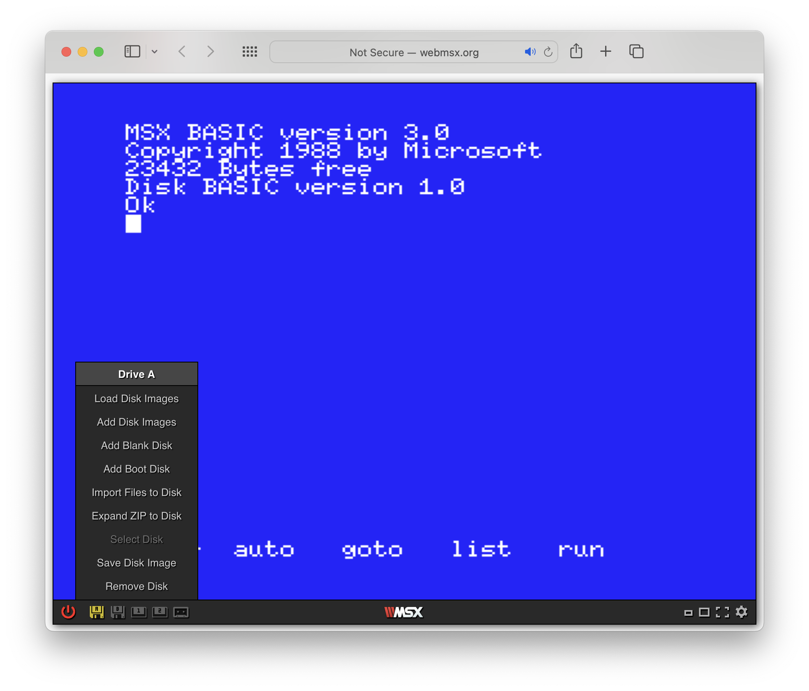
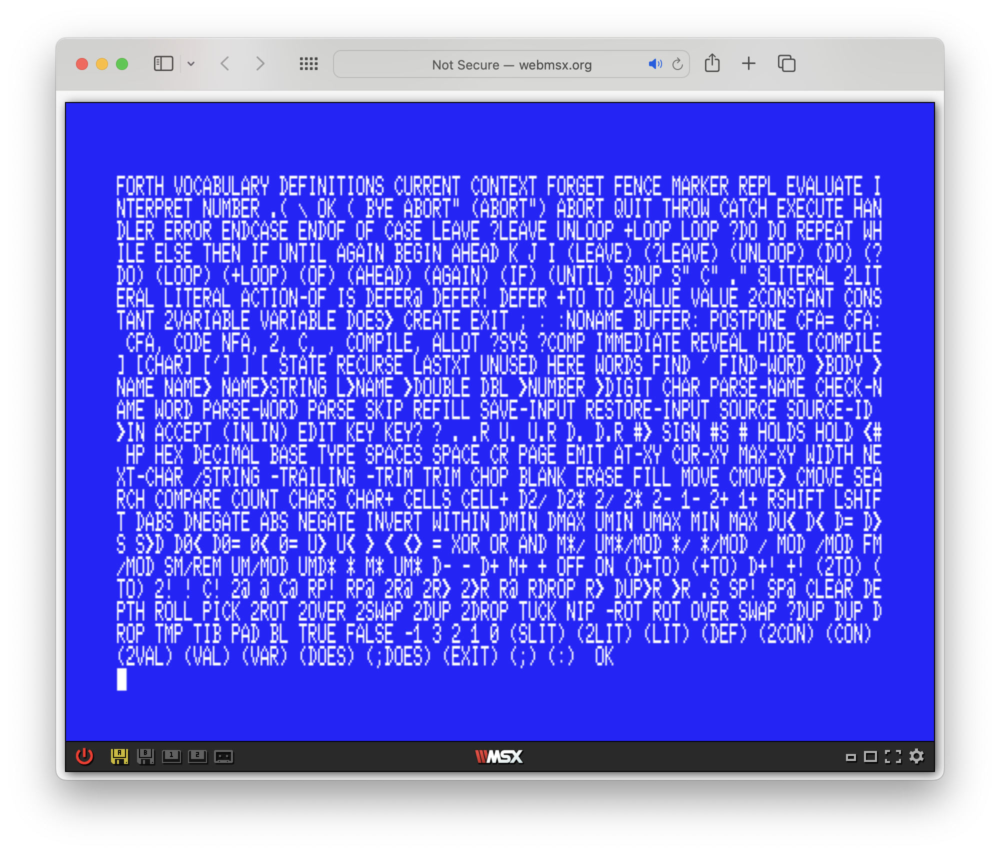
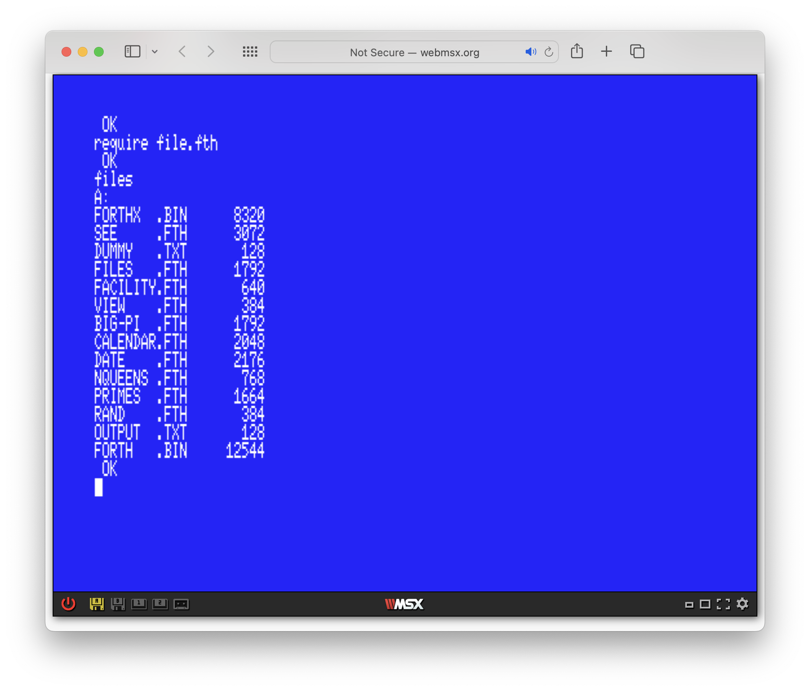
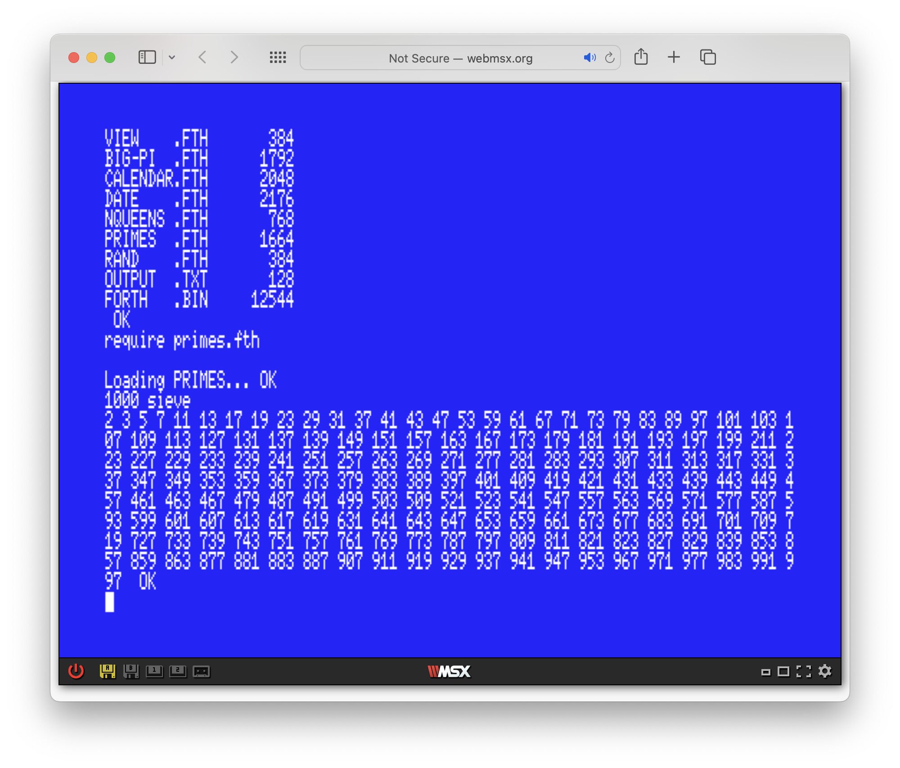
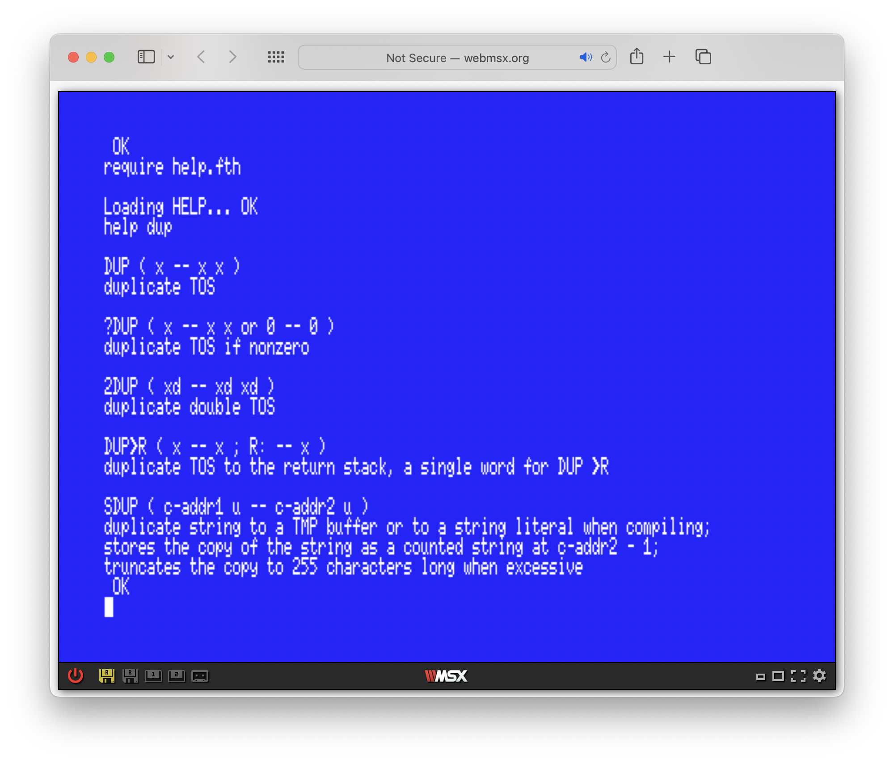

# ForthMSX - a Forth 2012 standard system for MSX

The goal of this ongoing project is to implement a "wicked fast" [Forth 2012 standard](https://forth-standard.org/standard/words) system for MSX.

Why do I believe this is useful? There is [Kuma Forth](https://www.jupiter-ace.co.uk/downloads/books/KumaForthManual%20.pdf) for MSX after all, published in 1984.  While KForth is historically important, it is limited and outdated.  It neither does justice to the Forth programming language nor to the capabilities of MSX.

See the [ForthMSX words](doc/words.md) that are built-in.  Additional word definitions can be loaded and compiled.

If you don't have an MSX machine or just want to try out ForthMSX, then visit [WebMSX](http://webmsx.org).  To run ForthMSX in WebMSX, click the WebMSX floppy drive icon on the bottom-left, then "Import Files to Disk":

Select the `forth.bin` file (or small `forthx.bin` file) located in your forked copy of this project and import it to the floppy disk in drive A.

Run Forth in WebMSX:

    clear 100,&h8400
    bload "forth.bin",r

This full ForthMSX version of standard Forth with MSX floating point math and MSX-DOS1 file access takes a little over 13K to run.  Without math and file access it is about 8K.

Once you've been greeted by the Forth system, type `80 width` and ENTER to switch to 80 characters per line.  Then `words` and ENTER to list all Forth words, one screenful at a time (press a key to continue).

The Forth screen editor is the same as the BASIC screen editor you're probably familiar with.  So you can use familiar key combinations and ways to enter Forth commands, edit them, and rerun them as desired.

ForthMSX uses the available 32K BASIC RAM without using other RAM slots.  This supports all 64K MSX systems.  In the future, it makes perhaps sense to release a version that runs Forth in certain RAM slots concurrently to BASIC/MSX-DOS/Nextor.

With the current full version `forth.bin` you can extend Forth by loading Forth source code and try some examples.  Locate the `FILE.FTH` source [`src/FILE.FTH`](src/FILE.FTH) and import this file to disk in WebMSX.  Then type `require file.fth` in ForthMSX to load and compile Forth files definitions (takes about a second).  Then type `files`:

The [examples](examples) directory of this project includes a prime number sieve.  Import `PRIMES.FTH` to disk.  Type `require primes.fth` and `1000 sieve`:

To delete all definitions loaded from a file, such as `PRIMES.FTH`, type `~primes.fth` (like a C++ destructor uses `~`).

If a Forth source file is changed, then reload it with `anew primes.fth` to delete all its definitions first and compile it again.

Important: if you're importing updated files to disk in WebMSX, then you need to delete your old file `name.fth` first in Forth by executing `s" name.fth" delete-file .`, otherwise WebMSX adds the file to the disk with a new name with a tilde `~` and does not overwrite the old file.

Another example is a help facility.  To use it, copy `HELP.FTH` and `HELP.TXT` from the [examples](examples) directory to disk A to `require help.fth`:

The `help` command takes (part of) a name to search in the help file to explain.

Enter `bye` in Forth to exit back to BASIC.  You can return to Forth where you left off in Forth from BASIC with:

    defusr0=&h8400:?usr0(0)

## Forth 2012 standard compliance and coverage

- Core and Core-Ext (built-in, complete coverage)
- Block (none, Forth old block-style buffers will not be implemented)
- Double-Numbers and Double-Numbers-Ext (built-in, complete coverage)
- Exception and Exception-Ext (built-in, complete coverage)
- Facility and Facility-Ext (built-in, except for `K-*` words, require FACILITY.FTH for complete coverage)
- File-Access and File-Access-Ext (built-in, require FILE.FTH for complete coverage)
- Floating-Point and Floating-Point-Ext (built-in, require FLOAT.FTH for complete coverage)
- Locals (none, will not be implemented)
- Memory-Allocation (under consideration)
- Programming-Tools and Programming-Tools-Ext (built-in, require TOOLS.FTH and SEE.FTH)
- String and String-Ext (built-in, complete except for `REPLACE` `SUBSTITUTE` `ESCAPE`)
- Extended-Character (none, MSX does not support variable-width character encodings)

## Work in progress

Words for MSX graphics and sound will be added in the near future.

Include a complete Forth manual in the near future, similar to the Forth manual I wrote for [Forth500](https://github.com/Robert-van-Engelen/Forth500).

A "headless" ForthMSX can be assembled, which is only half the size.  This is a nice feature for stand-alone application development from which the Forth interpreter can be removed.  This is already possible by (re)setting the `REPL` and `MAIN` flags in the `forth.asm` source to assemble, but it is not ideal to write Forth in low-level code.  Ideal would be to develop and use a new external Forth compiler for "headless" application development.
